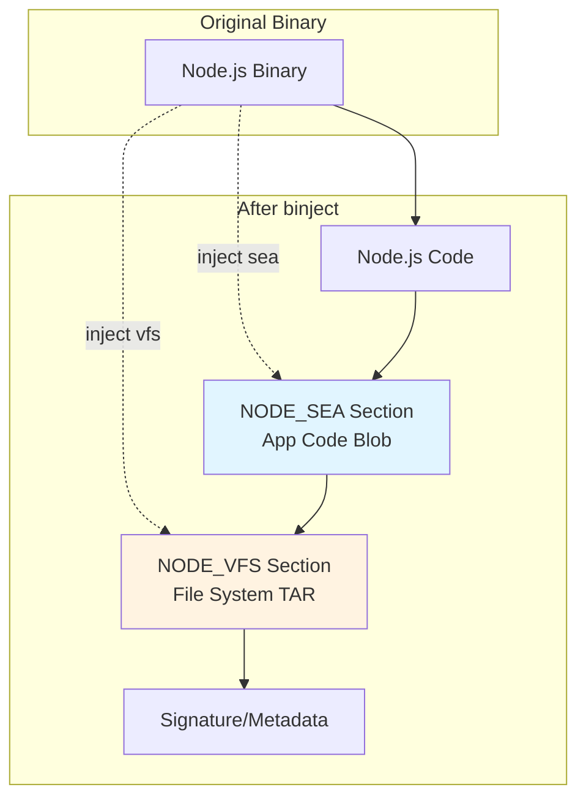

# binject

Binary resource injection tool for Mach-O, ELF, and PE executables.

## Features

- **Auto-overwrite**: Automatically replaces existing resources without manual flags
- **Automatic SEA blob generation**: Pass `.json` config files directly - binject runs `node --experimental-sea-config` automatically
- Inject resources into NODE_SEA or NODE_VFS sections
- **Batch injection**: Inject both SEA and VFS resources in a single operation
- Automatic compression (LZFSE on all platforms)
- List, extract, and verify embedded resources
- **Smart fuse handling**: Detects and preserves already-flipped NODE_SEA_FUSE
- Platform-specific implementations:
  - **macOS**: Mach-O using LIEF library for proper binary manipulation
  - **Linux**: ELF using direct binary manipulation
  - **Windows**: PE using direct binary manipulation

### Binary Layout After Injection



**Sections:**
- `NODE_SEA` - Single Executable Application code (generated by Node.js)
- `NODE_VFS` - Optional filesystem archive (TAR.GZ, can be in-memory or on-disk)
- `NODE_SEA_FUSE` - Marker flipped after first injection to prevent re-injection

## Installation

### Quick Install (Pre-built Binary)

Pre-built binaries are available for macOS, Linux, and Windows.

### Building from Source

```bash
pnpm run build
```

Outputs to `build/{dev|prod}/out/Final/binject` (or `binject.exe` on Windows).

**Install built binary:**
```bash
# Option 1: Copy to /usr/local/bin
sudo cp build/prod/out/Final/binject /usr/local/bin/

# Option 2: Add to PATH (add to ~/.zshrc or ~/.bashrc)
export PATH="$PATH:$(pwd)/build/prod/out/Final"
```

## Usage

### Inject Resources

```bash
# Inject SEA blob (Single Executable Application)
binject inject -e ./node -o ./node-sea --sea app.blob

# Inject VFS from a directory (auto-creates tar.gz internally)
binject inject -e ./node -o ./node-vfs --sea app.blob --vfs ./my-files/

# Inject VFS from a tar.gz file
binject inject -e ./node -o ./node-vfs --sea app.blob --vfs files.tar.gz

# Inject VFS from an uncompressed tar (auto-compresses internally)
binject inject -e ./node -o ./node-vfs --sea app.blob --vfs files.tar

# Inject VFS with --vfs-on-disk (alias for --vfs) - extracts to disk at runtime
binject inject -e ./node -o ./node-vfs --sea app.blob --vfs-on-disk ./my-files/

# Inject VFS and keep in memory at runtime (no extraction to disk)
binject inject -e ./node -o ./node-sea-vfs --sea app.blob --vfs-in-memory files.tar.gz

# Enable VFS support without bundling files (compatibility mode)
binject inject -e ./node -o ./node-sea --sea app.blob --vfs-compat

# Auto-overwrite: Automatically replaces existing resources
# No --overwrite flag needed - binject automatically detects and replaces existing segments
binject inject -e ./node-sea -o ./node-sea --sea updated-app.blob
```

**VFS Input Formats:**
- **Directory**: Automatically creates a tar.gz archive from the directory contents
- **`.tar.gz` / `.tgz`**: Used directly (gzip-compressed tar archive)
- **`.tar`**: Automatically compressed with gzip before embedding
- **Other**: Auto-detected - if gzip magic bytes found, used as-is; otherwise assumed tar and compressed

### SEA from JSON Config

Pass any `.json` file to `--sea` and binject automatically generates the blob:

```bash
# Create config (any .json filename works)
echo '{ "main": "app.js", "output": "sea-prep.blob" }' > sea-config.json

# Auto-generates blob via: node --experimental-sea-config sea-config.json
binject inject -e ./node -o ./node-sea --sea sea-config.json --vfs vfs.tar.gz
```

Paths in config are relative to current directory (matches [Node.js SEA](https://nodejs.org/api/single-executable-applications.html) behavior).

### VFS Configuration in sea-config.json

You can configure VFS directly in your sea-config.json file (instead of using CLI flags):

```bash
# Create config with VFS settings
cat > sea-config.json << 'EOF'
{
  "main": "app.js",
  "output": "sea-prep.blob",
  "smol": {
    "vfs": {
      "mode": "on-disk",
      "source": "node_modules"
    }
  }
}
EOF

# VFS settings are automatically applied
binject inject -e ./node -o ./node-sea --sea sea-config.json
```

**VFS Configuration Options:**

Minimal (uses defaults):
```json
{
  "smol": {
    "vfs": true
  }
}
```
Defaults: `mode: "in-memory"`, `source: "node_modules"`

Full configuration:
```json
{
  "smol": {
    "vfs": {
      "mode": "on-disk",
      "source": "dist/vfs.tar.gz"
    }
  }
}
```

**VFS Modes:**
- `"in-memory"` - Keep VFS in memory (default)
- `"on-disk"` - Extract to temp directory at runtime
- `"compat"` - Enable VFS APIs without bundling files

**VFS Sources:**
- Directory path - Auto-archived and compressed
- `.tar` file - Auto-compressed with gzip level 9
- `.tar.gz` / `.tgz` file - Used as-is

**CLI Flag Priority:**
CLI flags always override sea-config.json settings. Use CLI flags for one-off builds, use sea-config.json for repeatable builds.

See [sea-config-integration.md](./sea-config-integration.md) for full VFS configuration documentation.

### Configure Automatic Updates

Configure automatic update checking via the `smol.update` section in sea-config.json:

```bash
# Create sea-config.json with update configuration
cat > sea-config.json << 'EOF'
{
  "main": "app.js",
  "output": "sea-prep.blob",
  "smol": {
    "update": {
      "url": "https://api.github.com/repos/MyOrg/my-app/releases",
      "tag": "v*",
      "binname": "my-app",
      "command": "my-app update",
      "skip_env": "MY_APP_SKIP_UPDATE_CHECK"
    }
  }
}
EOF

# Update config is automatically embedded when using sea-config.json
binject inject -e ./node-smol -o ./my-app --sea sea-config.json
```

**Update Configuration Schema:**

| Field | Type | Default | Description |
|-------|------|---------|-------------|
| `url` | string | required | GitHub releases API URL |
| `tag` | string | `""` | Release tag pattern (glob: `*`, `?` supported) |
| `binname` | string | `""` | Binary name shown in notifications |
| `command` | string | `"self-update"` | Command shown in update notification |
| `skip_env` | string | `""` | Environment variable name to skip updates |
| `interval` | number | `86400000` | Check interval in milliseconds (24h) |
| `notify_interval` | number | `86400000` | Notification interval in milliseconds (24h) |
| `prompt` | boolean | `false` | Show interactive update prompts |
| `prompt_default` | string | `"n"` | Default answer for prompts: `"y"` or `"n"` |

**Notes:**
- Config is always enabled when embedded (presence = enabled)
- Runtime disable via environment variable: `MY_APP_SKIP_UPDATE_CHECK=1 ./my-app`
- Updates skip automatically in CI environments or non-TTY contexts
- Config stored in binary format (1176 bytes, validated at build time)
- Build fails for invalid config (too long, wrong type, invalid URL)

See [sea-config-integration.md](./sea-config-integration.md) for full documentation.

### List Resources

```bash
binject list ./node
```

### Extract Resources

```bash
# Extract SEA blob
binject extract -e ./node --sea -o app.blob

# Extract VFS blob
binject extract -e ./node --vfs -o vfs.blob
```


## Segments and Sections

### Compressed Stub Binary (created by binpress + segment compression)
- **Segment**: `SMOL`
  - `__PRESSED_DATA` - Compressed Node.js binary data

### Node.js Binary (SEA/VFS injection target)
- **Segment**: `NODE_SEA` (created by binject on first injection)
  - `__NODE_SEA_BLOB` - Single Executable Application code (injected with `--sea`)
  - `__SMOL_VFS_BLOB` - Virtual File System data (injected with `--vfs`)

## Platform Support

| Platform | Binary Format | Compression | Status |
|----------|--------------|-------------|--------|
| macOS    | Mach-O       | LZFSE       | ✅ Fully implemented (LIEF library + segment compression) |
| Linux    | ELF          | LZFSE       | ✅ Fully implemented |
| Windows  | PE           | LZFSE       | ✅ Fully implemented |

## Auto-Overwrite

Binject automatically replaces existing resources on repeated injections:

```bash
# First injection
binject inject -e node -o node-app --sea app-v1.blob

# Update with new version (auto-overwrites)
binject inject -e node-app -o node-app --sea app-v2.blob

# Update again (still works)
binject inject -e node-app -o node-app --sea app-v3.blob
```

## Notes

- On macOS, binaries are automatically code-signed with ad-hoc signature after injection
- VFS files are extracted to `~/.socket/_dlx/<hash>/vfs/` at runtime by default for lower memory usage
- Use `--vfs-in-memory <path>` to inject a tar and keep it in memory at runtime (useful for read-only filesystems or security-sensitive environments)
- Use `--vfs-compat` to enable VFS support without bundling files (compatibility mode)
- SEA blobs automatically flip sentinel byte for Node.js compatibility (once)
- Update config is embedded via sea-config.json smol.update section (1176 bytes, binary format validated at build time)
- Embedded update config is always enabled; disable at runtime via environment variable (see `skip_env` field)
- Unicode symbols used for output: `✓` (success), `⚠` (warning), consistent with socket-lib

## License

MIT
