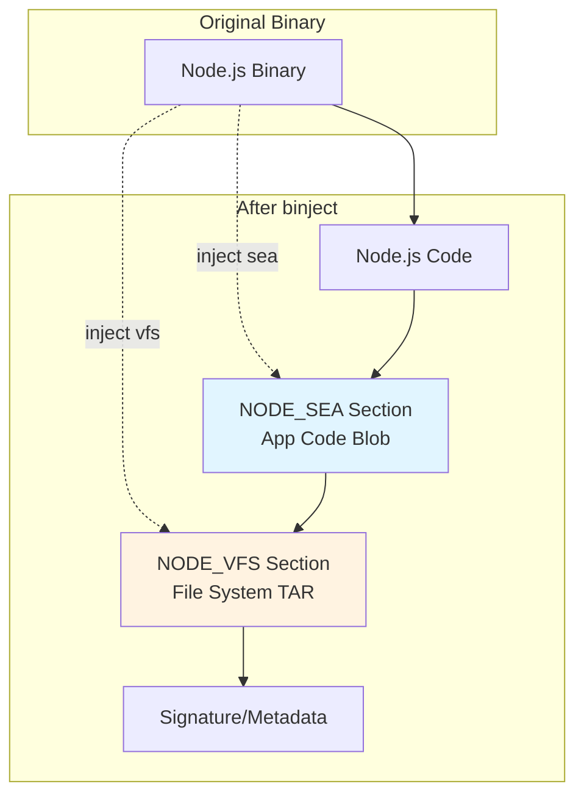

# binject

Binary resource injection tool for Mach-O, ELF, and PE executables.

## Features

- **Auto-overwrite**: Automatically replaces existing resources without manual flags
- **Automatic SEA blob generation**: Pass `.json` config files directly - binject runs `node --experimental-sea-config` automatically
- Inject resources into NODE_SEA or NODE_VFS sections
- **Batch injection**: Inject both SEA and VFS resources in a single operation
- Automatic compression (LZFSE/LZMA/LZMS based on platform)
- List, extract, and verify embedded resources
- **Smart fuse handling**: Detects and preserves already-flipped NODE_SEA_FUSE
- Platform-specific implementations:
  - **macOS**: Mach-O using LIEF library for proper binary manipulation
  - **Linux**: ELF using direct binary manipulation
  - **Windows**: PE using direct binary manipulation

### Binary Layout After Injection



**Sections:**
- `NODE_SEA` - Compressed application code (Brotli, ~70-80% reduction)
- `NODE_VFS` - Optional filesystem archive (TAR.GZ, can be in-memory or on-disk)
- `NODE_SEA_FUSE` - Marker flipped after first injection to prevent re-injection

## Installation

### Quick Install (Pre-built Binary)

Download the latest release for your platform and make it executable:

**macOS/Linux:**
```bash
# Download binary (replace URL with latest release)
curl -L -o binject https://github.com/your-org/binject/releases/latest/download/binject-$(uname -s)-$(uname -m)

# Make executable
chmod +x binject

# Move to PATH
sudo mv binject /usr/local/bin/
```

**Verify:**
```bash
binject --version
binject --help
```

### Building from Source

```bash
make
```

Outputs `out/binject` (or `out/binject.exe` on Windows).

**Install built binary:**
```bash
# Option 1: Use make
sudo make install

# Option 2: Manual install
sudo cp out/binject /usr/local/bin/

# Option 3: Add to PATH (add to ~/.zshrc or ~/.bashrc)
export PATH="$PATH:$(pwd)/out"
```

## Usage

### Inject Resources

```bash
# Inject SEA blob (Single Executable Application)
binject inject -e ./node -o ./node-sea --sea app.blob

# Inject VFS blob (Virtual File System) - extracts to disk at runtime by default
binject inject -e ./node -o ./node-vfs --sea app.blob --vfs vfs.tar.gz

# Inject VFS with --vfs-on-disk (alias for --vfs)
binject inject -e ./node -o ./node-vfs --sea app.blob --vfs-on-disk vfs.tar.gz

# Inject VFS and keep in memory at runtime (no extraction to disk)
binject inject -e ./node -o ./node-sea-vfs --sea app.blob --vfs-in-memory vfs.tar.gz

# Enable VFS support without bundling files (compatibility mode)
binject inject -e ./node -o ./node-sea --sea app.blob --vfs-compat

# Auto-overwrite: Automatically replaces existing resources
# No --overwrite flag needed - binject automatically detects and replaces existing segments
binject inject -e ./node-sea -o ./node-sea --sea updated-app.blob
```

### SEA from JSON Config

Pass any `.json` file to `--sea` and binject automatically generates the blob:

```bash
# Create config (any .json filename works)
echo '{ "main": "app.js", "output": "sea-prep.blob" }' > sea-config.json

# Auto-generates blob via: node --experimental-sea-config sea-config.json
binject inject -e ./node -o ./node-sea --sea sea-config.json --vfs vfs.tar.gz
```

Paths in config are relative to current directory (matches [Node.js SEA](https://nodejs.org/api/single-executable-applications.html) behavior).

### List Resources

```bash
binject list ./node
```

### Extract Resources

```bash
# Extract SEA blob
binject extract -e ./node --sea -o app.blob

# Extract VFS blob
binject extract -e ./node --vfs -o vfs.blob
```


## Segments and Sections

### Compressed Stub Binary (created by binpress + segment compression)
- **Segment**: `SMOL`
  - `__PRESSED_DATA` - Compressed Node.js binary data

### Node.js Binary (SEA/VFS injection target)
- **Segment**: `NODE_SEA` (created by binject on first injection)
  - `__NODE_SEA_BLOB` - Single Executable Application code (injected with `--sea`)
  - `__SMOL_VFS_BLOB` - Virtual File System data (injected with `--vfs`)

## Platform Support

| Platform | Binary Format | Compression | Status |
|----------|--------------|-------------|--------|
| macOS    | Mach-O       | LZFSE/LZMA  | ✅ Fully implemented (LIEF library + segment compression) |
| Linux    | ELF          | LZMA        | ✅ Fully implemented |
| Windows  | PE           | LZMS        | ✅ Fully implemented |

## Auto-Overwrite

Binject automatically replaces existing resources on repeated injections:

```bash
# First injection
binject inject -e node -o node-app --sea app-v1.blob

# Update with new version (auto-overwrites)
binject inject -e node-app -o node-app --sea app-v2.blob

# Update again (still works)
binject inject -e node-app -o node-app --sea app-v3.blob
```

## Notes

- On macOS, binaries are automatically code-signed with ad-hoc signature after injection
- VFS files are extracted to `~/.socket/_dlx/<hash>/vfs/` at runtime by default for lower memory usage
- Use `--vfs-in-memory <path>` to inject a tar and keep it in memory at runtime (useful for read-only filesystems or security-sensitive environments)
- Use `--vfs-compat` to enable VFS support without bundling files (compatibility mode)
- Use runtime environment variable `VFS_IN_MEMORY=1` to override extraction behavior
- SEA blobs automatically flip sentinel byte for Node.js compatibility (once)
- Unicode symbols used for output: `✓` (success), `⚠` (warning), consistent with socket-lib

## License

MIT
