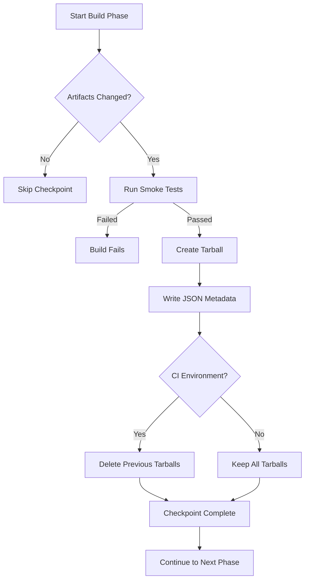
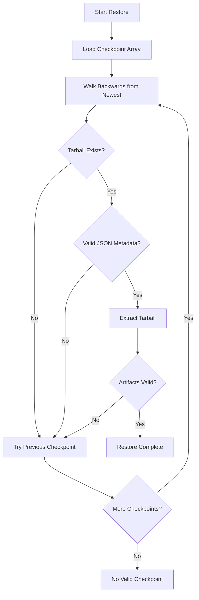
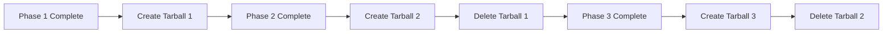
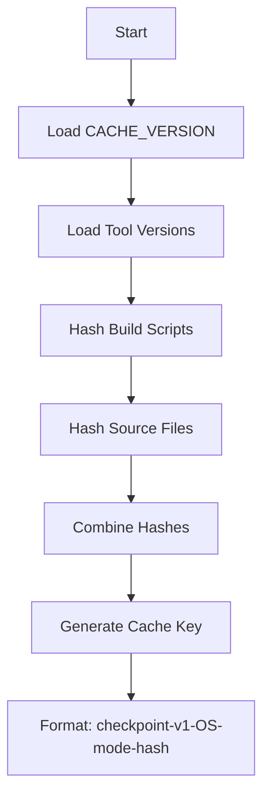
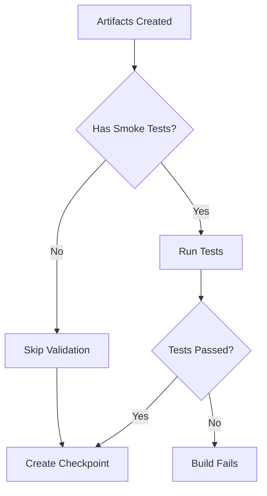
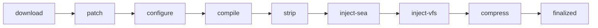
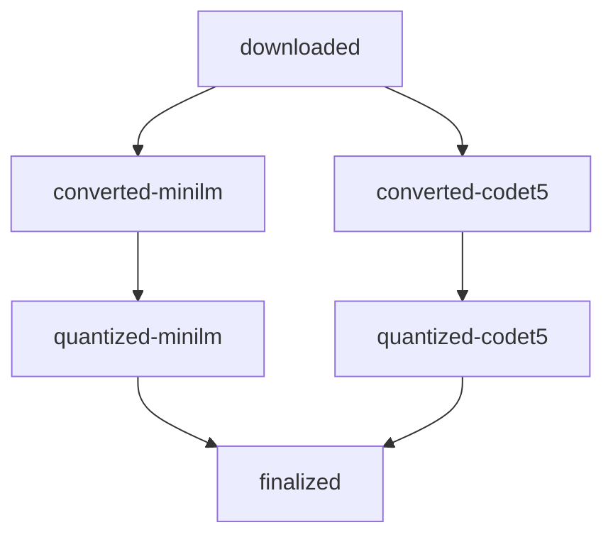

# Checkpoint Lifecycle

Visual guide to the checkpoint system used across all builder packages.

## Checkpoint Creation Flow



## Checkpoint Restoration Flow



## Checkpoint Structure

Each checkpoint consists of:

### 1. Tarball Archive
- **Location**: `build/<mode>/checkpoints/<name>.tar.gz`
- **Contents**: All artifacts from the build phase
- **Compression**: gzip
- **Cleanup**: In CI, previous tarballs deleted after new checkpoint validated

### 2. JSON Metadata
- **Location**: `build/<mode>/checkpoints/<name>.json`
- **Contents**:
  ```json
  {
    "name": "phase-name",
    "timestamp": "2025-12-09T12:34:56.789Z",
    "artifacts": ["file1", "file2"],
    "artifactPath": "build/prod/checkpoints/phase-name.tar.gz",
    "metadata": {
      "version": "1.0.0",
      "os": "darwin",
      "arch": "arm64"
    }
  }
  ```

## Progressive Cleanup (CI Only)

To conserve disk space in CI environments:



**Benefits:**
- Only 1 checkpoint tarball exists at a time
- Backward restoration still works (finds latest valid checkpoint)
- Saves gigabytes of disk space for large builds (ML models, Node.js)

**Local Development:**
- All checkpoint tarballs kept for debugging
- No automatic cleanup

## Cache Key Generation

Checkpoints are cached in GitHub Actions using content-addressable keys:



**Key Components:**
- `CACHE_VERSION` - Manual cache invalidation
- Tool versions (Python, Node.js, compilers)
- Build script hashes (cumulative)
- OS and build mode

## Smoke Testing

Each checkpoint includes smoke tests to validate artifacts:



**Common Smoke Tests:**
- Binary exists and is executable
- Binary runs with `--version`
- File size within expected range
- Model files have valid ONNX format

## Directory Structure

```
packages/<package>/
├── build/
│   ├── shared/              # Shared across dev/prod
│   │   ├── source/          # Downloaded/extracted sources
│   │   └── checkpoints/     # Shared checkpoint JSON files
│   ├── dev/
│   │   ├── source/          # Dev-specific source artifacts
│   │   ├── out/             # Dev build output
│   │   │   ├── Release/
│   │   │   ├── Stripped/
│   │   │   ├── Compressed/
│   │   │   └── Final/
│   │   └── checkpoints/     # Dev checkpoint tarballs + JSON
│   └── prod/
│       ├── source/          # Prod-specific source artifacts
│       ├── out/             # Prod build output
│       └── checkpoints/     # Prod checkpoint tarballs + JSON
```

## Example: Node.js Build Checkpoints



Each arrow represents a checkpoint that can be restored.

## Example: ML Model Checkpoints



Both model-specific and unified checkpoints are created.
