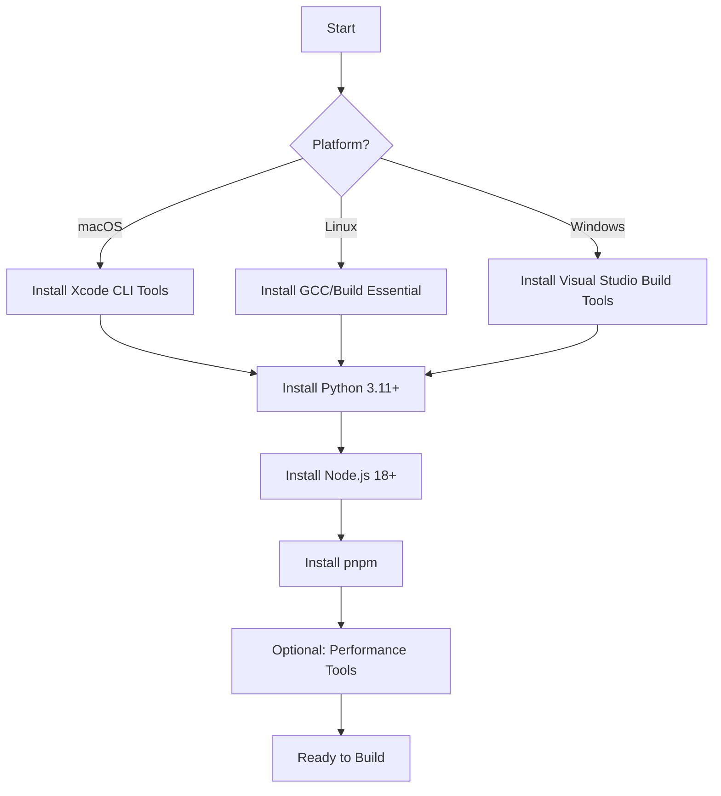

# Prerequisites

Get building in 2 minutes with automated toolchain setup.

## Quick Start

```bash
# Clone and install (auto-installs build tools via postinstall hooks)
git clone <repo-url> socket-btm
cd socket-btm
pnpm install

# Build something (e.g., binject)
cd packages/binject
pnpm build
```

That's it. `pnpm install` automatically runs toolchain setup for each package via postinstall hooks.

## Overview

Socket BTM requires platform-specific build tools and compilers. This guide covers setup for:
- **macOS** - Building Mach-O binaries (binject, binpress, binflate, node-smol)
- **Linux** - Building ELF binaries (binject, binpress, binflate, node-smol)
- **Windows** - Building PE binaries (binject, binpress, binflate, node-smol)

## Quick Start



## macOS

### Required Tools

**Xcode Command Line Tools** (provides clang, clang++, make)
```bash
xcode-select --install
```

**Python 3.11+** (for ML model builds)
```bash
brew install python@3.11
```

**Node.js 18+** (via nvm recommended)
```bash
curl -o- https://raw.githubusercontent.com/nvm-sh/nvm/v0.39.0/install.sh | bash
nvm install 18
nvm use 18
```

**pnpm** (package manager)
```bash
npm install -g pnpm
```

### Optional Tools

**Ninja** (faster builds)
```bash
brew install ninja
```

**ccache** (compiler cache)
```bash
brew install ccache
```

### Verification

```bash
clang --version       # Should show Apple clang 14+
python3 --version     # Should show 3.11+
node --version        # Should show v18+
pnpm --version        # Should show 8+
```

## Linux

### Required Tools

**Build Essential** (provides gcc, g++, make)
```bash
# Ubuntu/Debian
sudo apt-get update
sudo apt-get install -y build-essential

# RHEL/CentOS/Fedora
sudo yum groupinstall "Development Tools"
```

**Python 3.11+**
```bash
# Ubuntu/Debian
sudo apt-get install -y python3.11 python3-pip python3-venv

# RHEL/CentOS/Fedora
sudo yum install -y python3.11 python3-pip
```

**Node.js 18+** (via nvm recommended)
```bash
curl -o- https://raw.githubusercontent.com/nvm-sh/nvm/v0.39.0/install.sh | bash
nvm install 18
nvm use 18
```

**pnpm** (package manager)
```bash
npm install -g pnpm
```

### Optional Tools

**Ninja** (faster builds)
```bash
# Ubuntu/Debian
sudo apt-get install -y ninja-build

# RHEL/CentOS/Fedora
sudo yum install -y ninja-build
```

**ccache** (compiler cache)
```bash
# Ubuntu/Debian
sudo apt-get install -y ccache

# RHEL/CentOS/Fedora
sudo yum install -y ccache
```

### Verification

```bash
gcc --version         # Should show GCC 9+
python3 --version     # Should show 3.11+
node --version        # Should show v18+
pnpm --version        # Should show 8+
```

## Windows

### Required Tools

**Visual Studio 2022 Build Tools** (provides MSVC, MSBuild)

Download from: https://visualstudio.microsoft.com/downloads/

Install with workloads:
- Desktop development with C++
- C++ CMake tools for Windows

Or via command line:
```powershell
winget install Microsoft.VisualStudio.2022.BuildTools
```

**Python 3.11+**
```powershell
winget install Python.Python.3.11
```

**Node.js 18+**
```powershell
winget install OpenJS.NodeJS.LTS
```

**pnpm** (package manager)
```powershell
npm install -g pnpm
```

### Optional Tools

**Ninja** (faster builds)
```powershell
winget install Ninja-build.Ninja
```

### Verification

```powershell
cl.exe               # Should show MSVC 19.30+
python --version     # Should show 3.11+
node --version       # Should show v18+
pnpm --version       # Should show 8+
```

## Python Dependencies

For ML model building (minilm, codet5, models packages):

```bash
# Create virtual environment
python3 -m venv .venv
source .venv/bin/activate  # On Windows: .venv\Scripts\activate

# Install dependencies
pnpm install  # This also installs Python deps via setup scripts
```

Key Python packages:
- `transformers` - HuggingFace model loading
- `onnx` - ONNX model manipulation
- `onnxruntime` - ONNX inference
- `optimum` - Model quantization

## Troubleshooting

### macOS: Command Line Tools Missing

**Symptom**: `clang: command not found`

**Solution**:
```bash
xcode-select --install
# If already installed, reset:
sudo xcode-select --reset
```

### Linux: Python 3.11 Not Available

**Symptom**: `python3.11: command not found`

**Solution** (Ubuntu):
```bash
sudo add-apt-repository ppa:deadsnakes/ppa
sudo apt-get update
sudo apt-get install python3.11 python3.11-venv python3.11-dev
```

### Windows: MSVC Not Found

**Symptom**: `'cl.exe' is not recognized`

**Solution**:
```powershell
# Launch "Developer Command Prompt for VS 2022" or run:
"C:\Program Files\Microsoft Visual Studio\2022\BuildTools\VC\Auxiliary\Build\vcvars64.bat"
```

### All Platforms: pnpm Install Fails

**Symptom**: `ENOENT: no such file or directory`

**Solution**:
```bash
# Clear caches
pnpm store prune
rm -rf node_modules
rm pnpm-lock.yaml

# Reinstall
pnpm install
```

## Next Steps

After installing prerequisites:

1. **Build binary tools**:
   ```bash
   # Build all binary tools (binject, binpress, binflate)
   cd packages/binject && make
   cd ../binpress && make
   cd ../binflate && make
   ```

2. **Build Node.js binary**:
   See [node-smol-builder documentation](../../node-smol-builder/README.md)

3. **Build WASM modules**:
   See [onnxruntime-builder](../../onnxruntime-builder/README.md) and [yoga-layout-builder](../../yoga-layout-builder/README.md)

4. **Build ML models**:
   See [models documentation](../../models/README.md)

## CI/CD

GitHub Actions workflows automatically install these dependencies. See:
- `.github/workflows/node-smol.yml` - Node.js build pipeline
- `.github/workflows/models.yml` - ML model pipeline
- `.github/workflows/wasm.yml` - WASM build pipeline

External tool versions are centralized in `external-tools.json` files within each package.
