# Node.js Build Pipeline

Visual guide to the node-smol-builder build process.

## Complete Build Pipeline

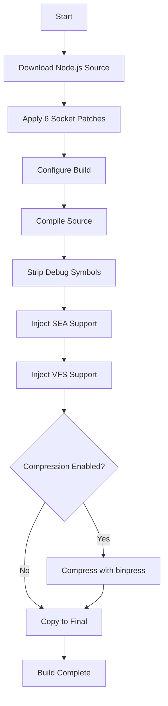

## Build Phases Detail

### Phase 1: Download

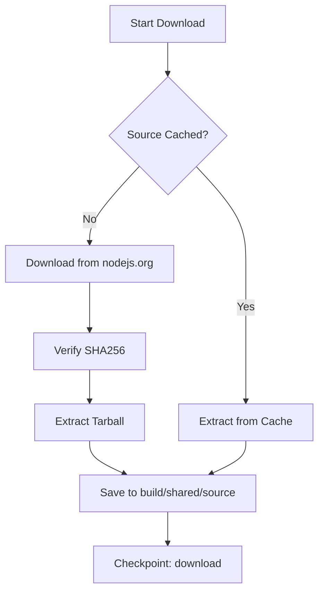

### Phase 2: Patch

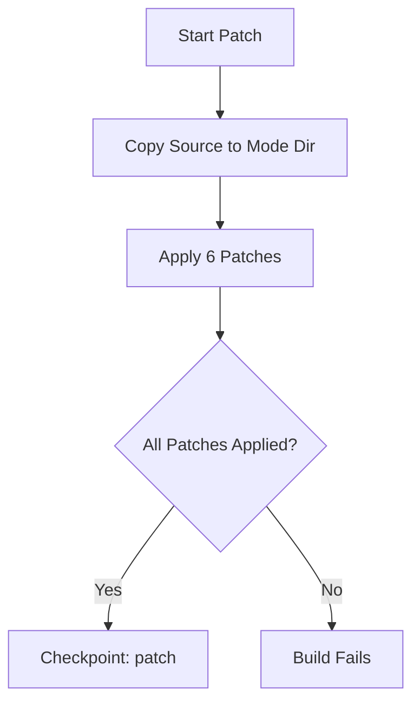

**Patch Categories:**
- Security hardening
- Dependency removal (npm, corepack, sqlite, inspector)
- SEA Brotli compression support
- VFS integration
- Size optimizations

### Phase 3: Configure

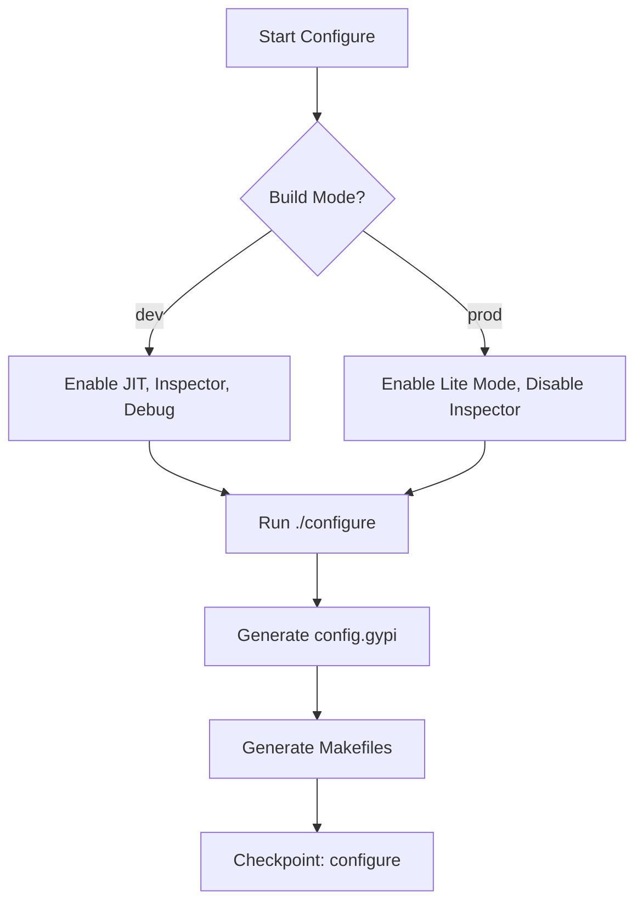

**Configure Flags (Common):**
- `--ninja` - Use Ninja build system
- `--with-intl=small-icu` - English-only ICU
- `--without-npm` - Remove npm
- `--without-corepack` - Remove corepack
- `--without-amaro` - Remove TypeScript/amaro
- `--without-node-options` - Disable NODE_OPTIONS

**Configure Flags (Prod Only):**
- `--without-inspector` - Remove debugger
- `--enable-lto` - Link-time optimization (Linux only)

### Phase 4: Compile

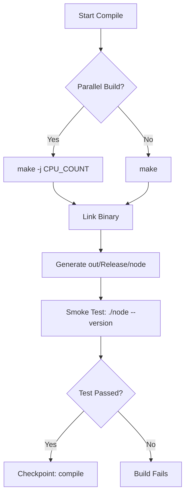

**Compile Time:**
- With cache: ~5 minutes (incremental)
- Without cache: ~30-45 minutes (full build)
- Parallel: Uses all CPU cores

### Phase 5: Strip

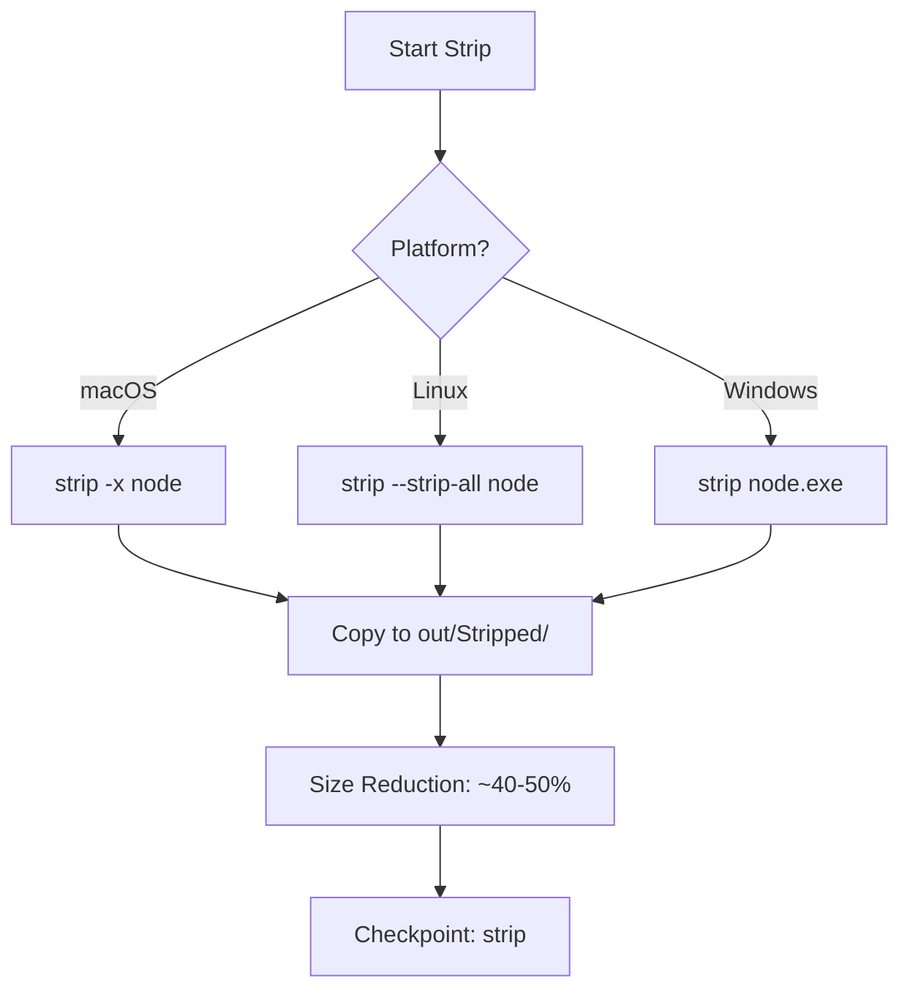

### Phase 6: Inject SEA

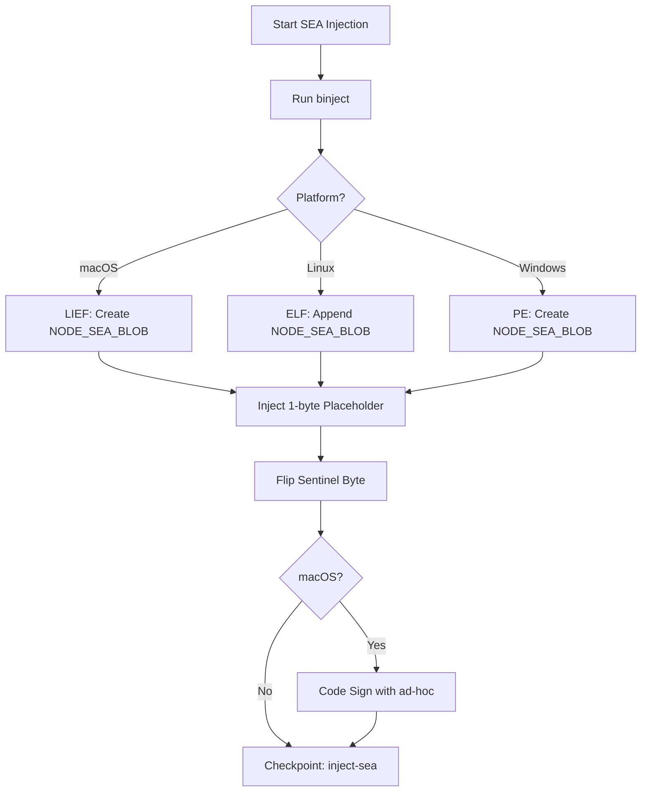

**SEA Section:**
- Section name: `NODE_SEA_BLOB`
- Initial size: 1 byte (placeholder)
- Dynamic creation: No placeholder files needed, sections created at injection time
- macOS: Uses LIEF for unlimited size support
- Linux/Windows: Appends new sections dynamically
- Sentinel: Auto-flipped for Node.js compatibility

### Phase 7: Inject VFS

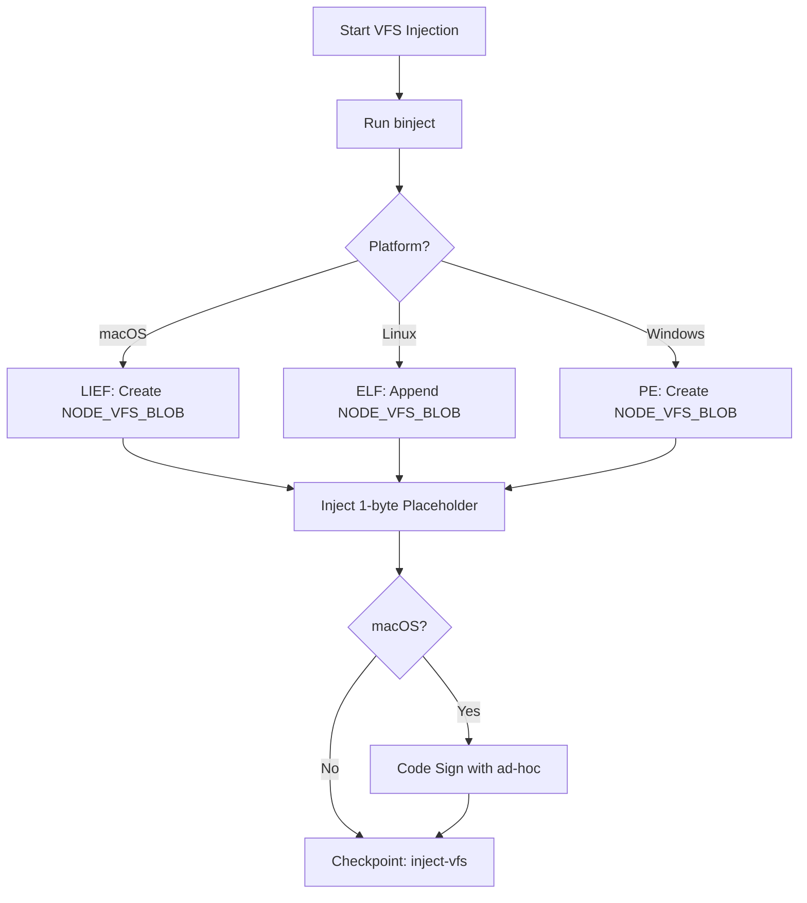

**VFS Section:**
- Section name: `NODE_VFS_BLOB`
- Initial size: 1 byte (placeholder)
- Dynamic creation: No placeholder files needed, sections created at injection time
- macOS: Uses LIEF for unlimited size support
- Linux/Windows: Appends new sections dynamically
- No compression: binpress will compress entire binary

### Phase 8: Compress (Optional)

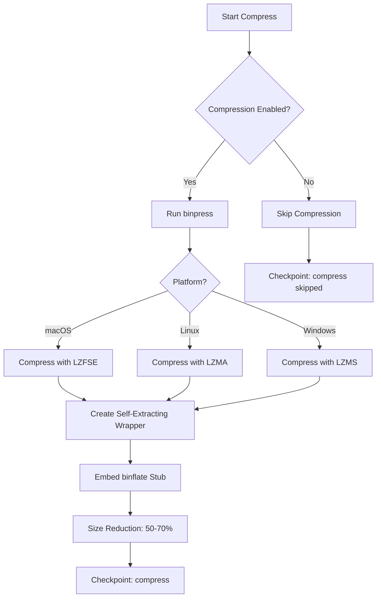

**Compression Benefits:**
- ~8-12 MB compressed vs ~23-27 MB uncompressed
- First-run decompression: ~100-200ms
- Cached runs: No decompression overhead
- Cache location: `~/.socket/_dlx/<cache-key>/`

### Phase 9: Finalize

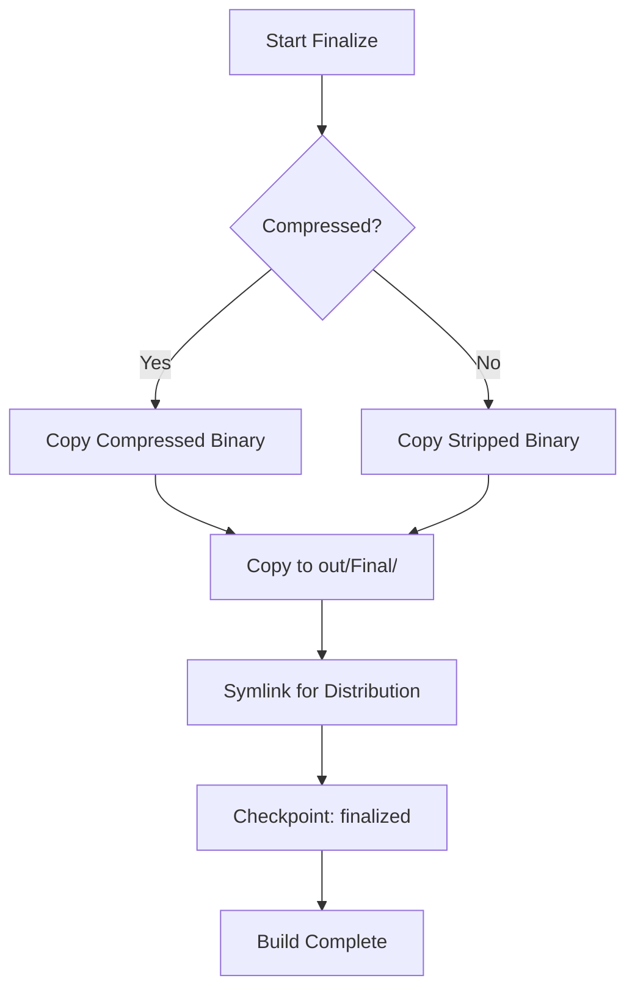

## Build Modes

### Development Mode

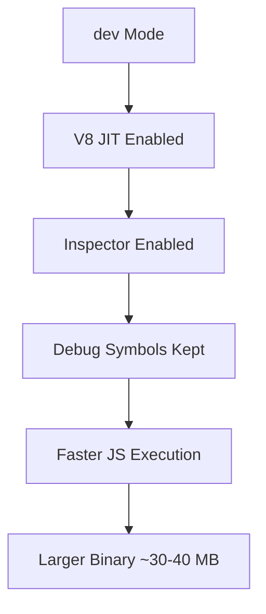

**Use Cases:**
- Local development
- Debugging
- Performance testing

### Production Mode

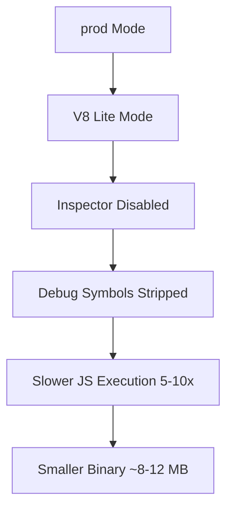

**Use Cases:**
- Distribution
- Embedded devices
- Size-constrained environments

## Binary Tools Integration

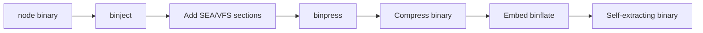

**Tool Responsibilities:**
- `binject`: Resource injection into executables
- `binpress`: Binary compression
- `binflate`: Runtime decompression and execution

## Checkpoint Benefits

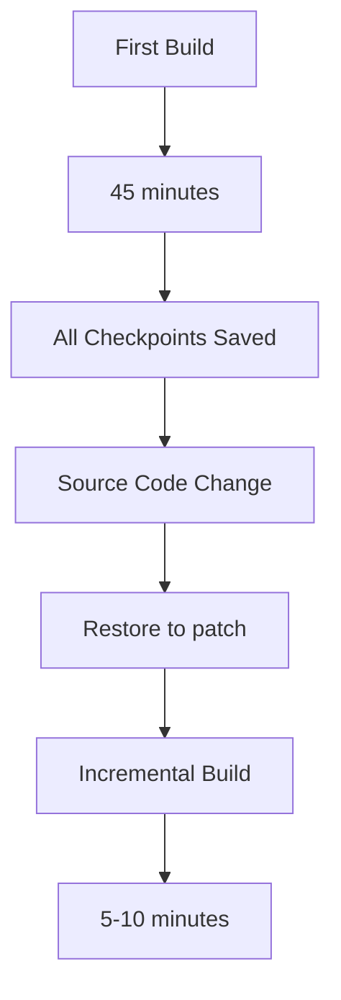

**Time Savings:**
- Full build: ~45 minutes
- Incremental (with checkpoints): ~5-10 minutes
- CI cache hit: ~2-3 minutes (just validation)

## Testing Pipeline

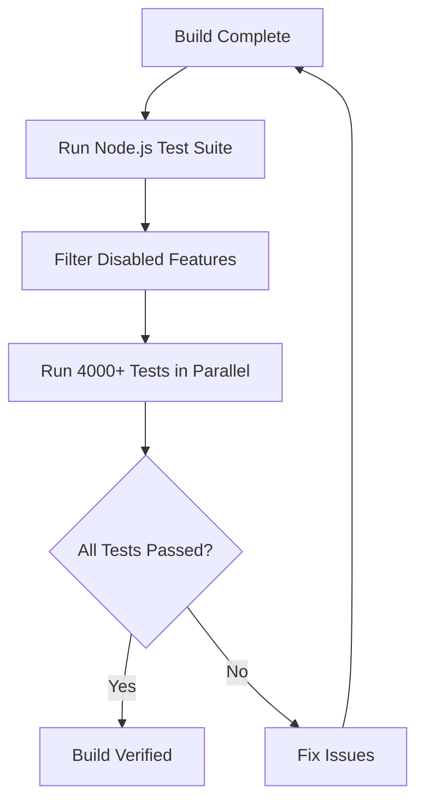

## Platform-Specific Notes

### macOS

- Uses LIEF for dynamic section creation with unlimited size support
- Requires code signing after injection
- LZFSE compression (Apple Compression Framework)
- Universal binaries possible (arm64 + x64)

### Linux

- Appends new ELF sections dynamically (no placeholders needed)
- LZMA compression (liblzma)
- Static linking for portability
- Separate glibc and musl builds

### Windows

- Creates new PE sections dynamically (no placeholders needed)
- LZMS compression (Windows Compression API)
- Requires MinGW or Visual Studio
- Cabinet.dll for compression
